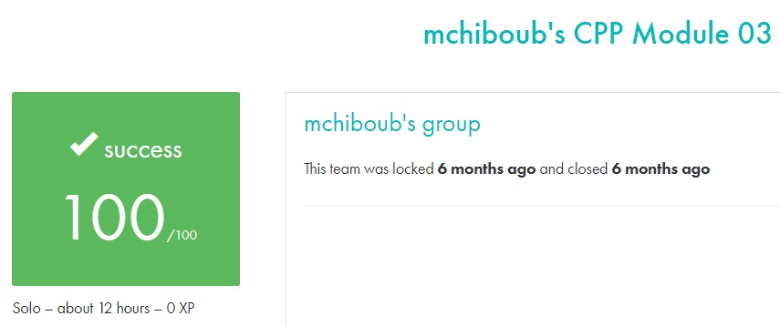

# C++ module 03 #

## What the project does: ##
The C++ - Module 03 project focuses on inheritance in C++. Through a series of exercises, it teaches how to implement classes that inherit attributes and methods from parent classes, with features such as constructing and destructing derived classes, adding custom behaviors, and handling multiple inheritance.

## Why the project is useful: ##
This project is useful because it introduces key concepts of object-oriented programming, specifically inheritance, which is essential for building reusable and scalable software. By learning how to manage inheritance hierarchies, you gain the ability to design more efficient and maintainable systems in C++.

[Subject of this project](en.subject.pdf)